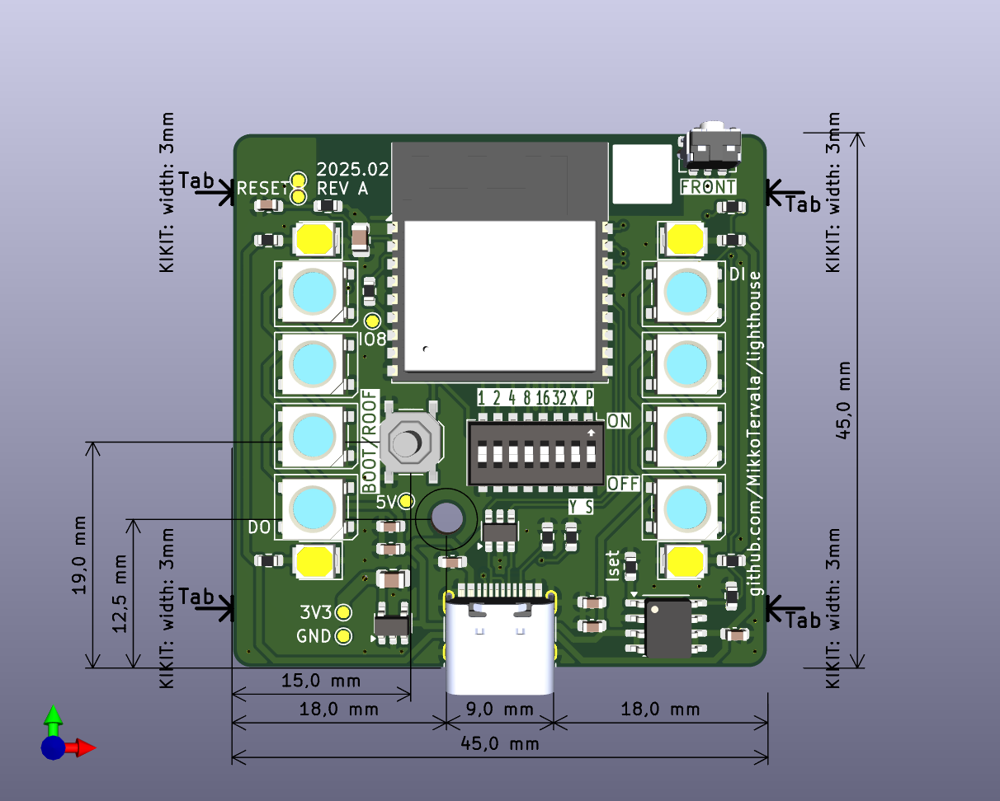

# Lighthouse

### Lighthouse for Family Connection

#### See also: [lighthouse-firmware](https://github.com/MikkoTervala/lighthouse-firmware)

**Lighthouse** is a connected smart decoration that synchronizes over the internet to let your family know when you're home.

## Views and Schematics

- **[🌐 Schematic View](https://kicanvas.org/?github=https%3A%2F%2Fgithub.com%2FMikkoTervala%2Flighthouse%2Fblob%2Fmain%2Fpcb%2Flighthouse-pcb.kicad_sch)**

- **[🌐 Board Layout](https://kicanvas.org/?github=https%3A%2F%2Fgithub.com%2FMikkoTervala%2Flighthouse%2Fblob%2Fmain%2Fpcb%2Flighthouse-pcb.kicad_pcb)**

- **[🌐 Interactive 3D View](https://3dviewer.net/index.html#model=https://raw.githubusercontent.com/MikkoTervala/lighthouse/refs/heads/main/pcb/lighthouse-pcb.step)**
